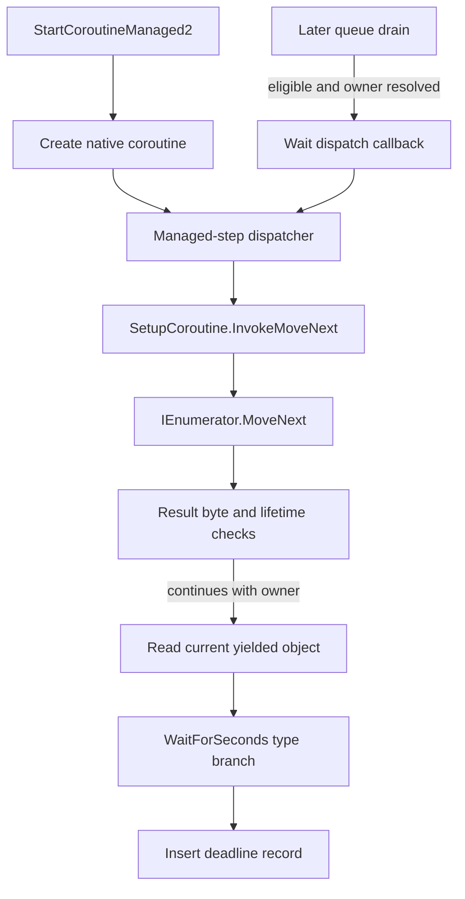

# Native coroutine creation, managed stepping and wait registration

Evidence level: **native-static** plus the pinned dumper's managed metadata.
The [report](../../reports/f530404b0f3f_807de4a83df4_unity_coroutine_bridge.json)
pins UnityPlayer, GameAssembly and global metadata separately. The audited
scope is the normal valid-owner path through a WaitForSeconds yield; it is
not the entire coroutine engine.

## Recovered call chain

The [internal-call registration audit](unity_icall_bindings.md) binds
StartCoroutineManaged2 to UnityPlayer `0x100CE0`. Its valid-owner path calls
creation helper `0x77BC80`, which allocates a 0x88-byte native coroutine record,
stores the owner at offset `0x58`, initializes a retain count at `0x60`, links
the record into the owner's list, and **immediately calls `0x778D90`**.

The shared dispatcher obtains the engine's cached managed method at slot
`0xCF0`. Cache initialization names `SetupCoroutine`, `InvokeMoveNext`, and
`UnityEngine.CoreModule.dll` and stores the resolved method in that slot. The
dispatcher builds invocation arguments containing the enumerator and the
address of a local result byte, then invokes the method through the same
pointer that the loader resolves as `il2cpp_runtime_invoke`.

The pinned GameAssembly method `UnityEngine.SetupCoroutine.InvokeMoveNext`
at `0x1C8A780` dispatches IEnumerator slot zero and writes the returned byte
through that supplied address. The dumper identifies metadata usage slot
`0x26FE930` as `System.Collections.IEnumerator_TypeInfo`; its interface metadata
declares slot zero as MoveNext, slot one as get_Current and slot two as Reset.
Those metadata identities are separate from the checked native instruction
relationships. The helper's null/error branches are outside this normal path.



The dispatcher retains the native record around the managed invocation. After
releasing that temporary reference it checks the saved count before following
any later continuation path. A successful continuing result, no captured
invocation error, and a retained owner lead to yielded-current dispatcher
`0x779070`. This path invokes the cached current getter through
`il2cpp_runtime_invoke`, then passes a non-null yielded object to `0x779370`.
The other result/lifetime branches must not be collapsed into a successful wait.

## WaitForSeconds and the later callback

Type dispatcher `0x779370` tests the yielded object's class against the cached
WaitForSeconds class in slot `0xDC8`, using the loader-resolved
`il2cpp_class_is_subclass_of` with its third argument set to one. The cache
initializer explicitly names `WaitForSeconds`. The successful type branch
retains the native coroutine, reads the yielded object's float duration at
offset `0x10`, and reaches the previously audited producer and insertion helper
`0x440F00`.

On a later eligible queue visit with a resolved owner, the consumer erases a
one-shot wait and invokes callback `0x778B30`. That callback checks the resolved
owner against the payload's stored owner and tail-calls the **same** managed-step
dispatcher. The separate release callback is `0x778BD0`; the consumer's exact
release-after-return condition is documented in the
[wait-boundary audit](unity_wait_boundary.md).

For the game's already audited `Character.<DelayReveal>d__84`, the first managed
step clones the shared action role and yields a `0.3f` WaitForSeconds; its next
step runs Character.Reveal and completes. This engine chain corroborates that
the first step happens within creation and that the delayed step re-enters the
same iterator through the shared managed bridge. It does not supply the next
drain's clock snapshot or choose an ordering among different pending records.

## Remaining limits and reproduction

Full inactive/destroyed-owner handling, cancellation during invocation, nested
iterators, exceptions, all reference-lifetime branches and other yield types
remain separate native work. No live process was read and no native handles
were added to solver state. UnityPlayer and UnityEngine.CoreModule methods are
outside the Assembly-CSharp coverage denominator, which remains 532 classified
methods with 276 evidence records.

```powershell
python reverse_engineering/scripts/audit_unityplayer_coroutines.py `
  'B:\SteamLibrary\steamapps\common\Demon Bluff Playtest' `
  --output reverse_engineering/reports/f530404b0f3f_807de4a83df4_unity_coroutine_bridge.json
```

The script verifies all three fingerprints before native decoding and checks
60 instruction, string and shared-pointer relationships across the two images.
Only authored findings, hashes and selected addresses are emitted. The private
UnityPlayer Ghidra analysis is independent support work; this report is based
on the directly verified native sites, not assumed decompiler success.

Validation passed the 60 native checks, 778 Python tests, 20 reverse-engineering
tests, Python compilation and diff checks. Rust/simulations were not rerun for
this audit-only checkpoint.
